# Decentralized FirmaEC

## Description
This project involves the development and implementation of a decentralized e-signature system adapted to a public institution in Ecuador, with three distinct yet interrelated components. The system is designed to ensure the secure signing and verification of documents and certificates, using the e-signature standards mandated by the Ecuadorian government. The project is divided into three key parts:

### 1. Architecture and Foundation
This component details the setup and configuration of the entire system, based on the guidelines from the Minka manual. It involves compiling necessary packages, setting up a WildFly server, deploying a Docker container with PostgreSQL, creating custom APIs, and establishing secure communication with the Ministry of Telecommunications (MINTEL). The outcome is a fully functional backend capable of signing documents, validating signatures, and verifying certificates with MINTEL.

- **Setup Resources:** The necessary Java application packages for compilation can be found at [Minka - Mintel FirmaEC](https://minka.gob.ec/mintel/ge/firmaec).
- **Servers and Configuration:** The servers required, including WildFly, Apache, and a PostgreSQL database hosted on Docker, were set up and configured correctly.

**Architecture Overview:**
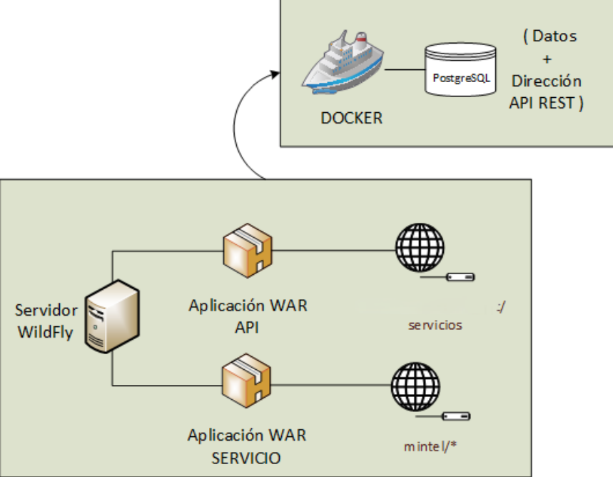
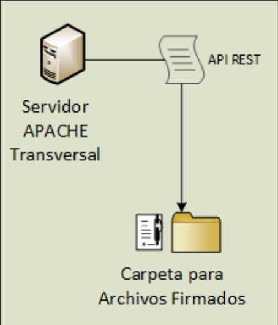

### 2. Transversal Web Page
Building on the previously established architecture, a web application was created to provide users with a platform for signing documents, validating e-signatures, and verifying certificates directly with MINTEL. The web application includes three main modules:
 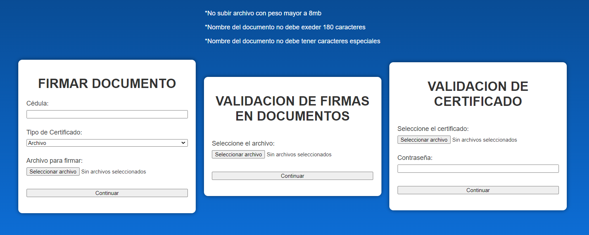
 
- **Sign Document Module:**
  - Users input their ID, select the type of certificate, and upload the document to be signed. The system displays the document, indicating whether it has been signed, and provides details on the validity of the signatures and the identities of previous signatories.
  
  **Document Signing Workflow:**
  - **Step 1:** User inputs ID and selects certificate type, uploads the document.
  - **Step 2:** Document details are displayed, showing signatures and validity.
  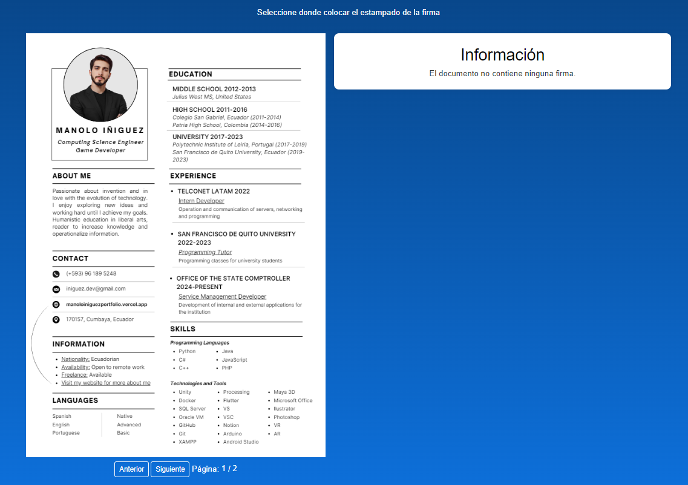
  - **Step 3:** User selects where to place the digital signature and clicks "Sign."
  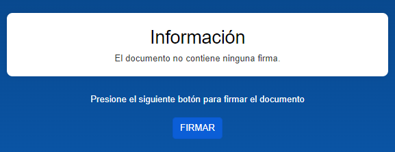
  - **Step 4:** FirmaEC application opens, allowing the user to select certificate type.
  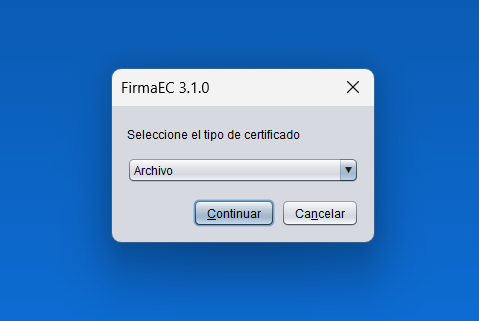
  - **Step 5:** User enters certificate and password.
  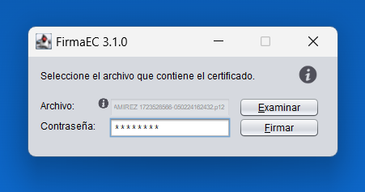
  - **Step 6:** Document is signed and automatically downloaded.
  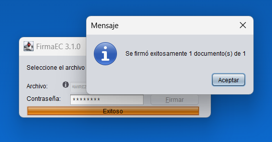

  **Document Re-Signing Workflow:**
  - If a document that has already been signed is processed again, the system automatically detects the existing signature and displays relevant information.
  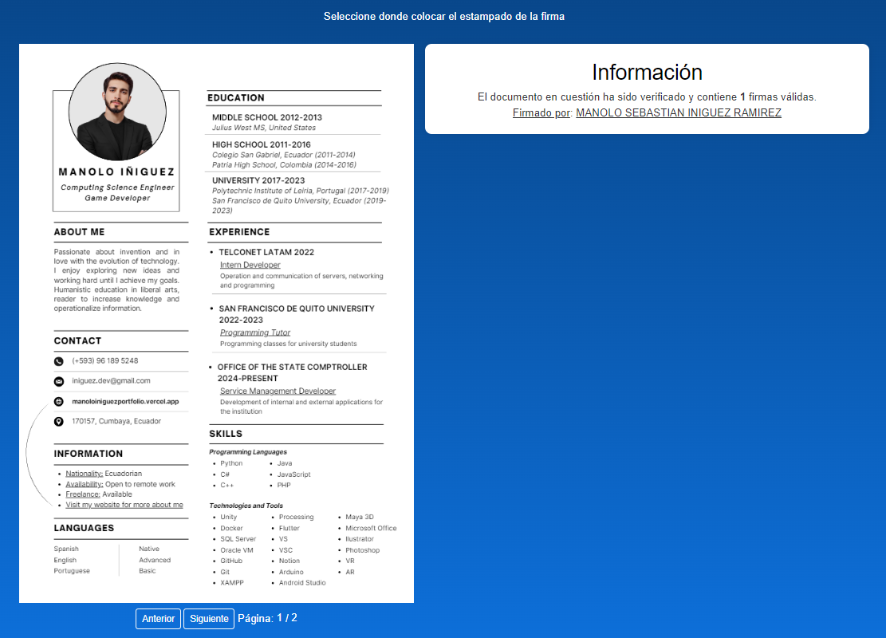
  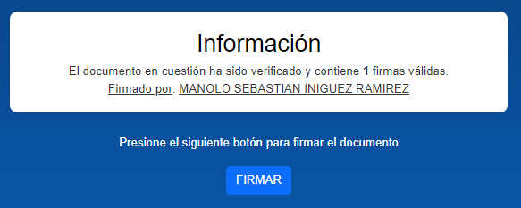

  **Invalid Document Workflow:**
  - The system prevents signing of documents that have been tampered with or signed with an invalid certificate, displaying appropriate error messages.
  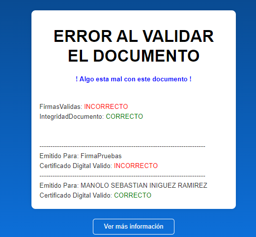
  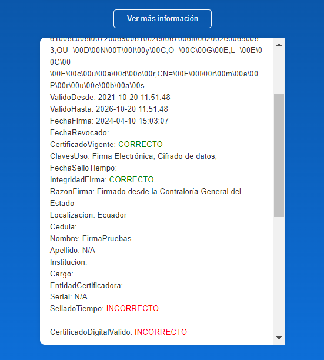

- **Signature Validation Module:**
  - Designed to allow users to upload a document and retrieve information on all signatures contained within.
  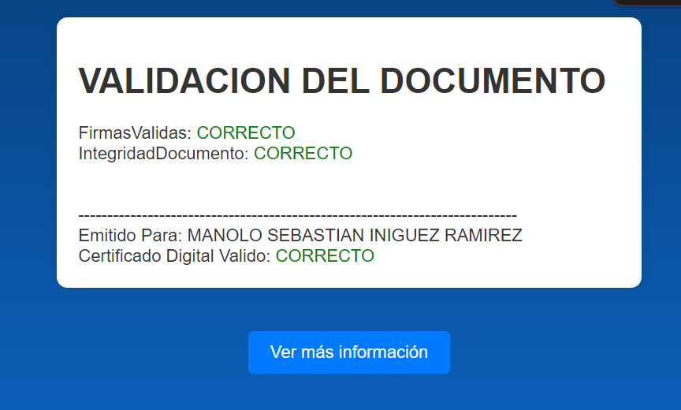
  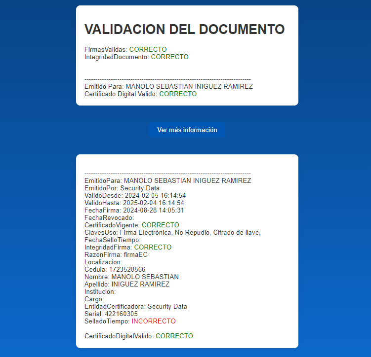

- **Certificate Validation Module:**
  - Allows users to input a certificate and retrieve detailed information about it.
  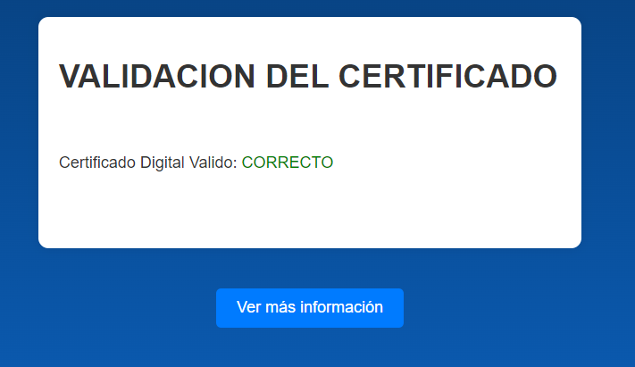
  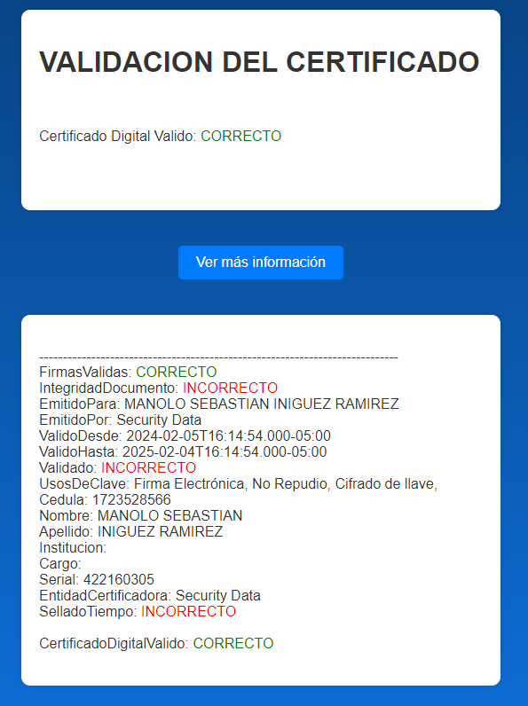

### 3. DLL Implementation
This component leverages the entire implemented architecture, adding C# code to integrate the e-signature system within the internal and external applications of one of the most important institutions in the country. This integration was personally developed by me, ensuring that all institutional paperwork is securely signed and verified directly within the applications, with no possibility of document forgery or invalidation.

**DLL Architecture:**
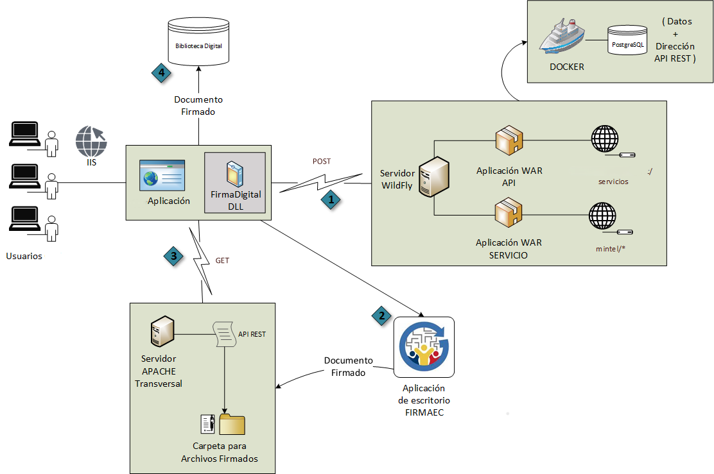

## Important Note
Due to privacy restrictions from the institution involved, I am unable to share the code or packages associated with this project. This explanation serves as a brief overview of a project that I consider pivotal to my personal and professional growth.
Please note that this is not a tutorial, but rather a basic and quick explanation of the system's architecture and functionalities.
